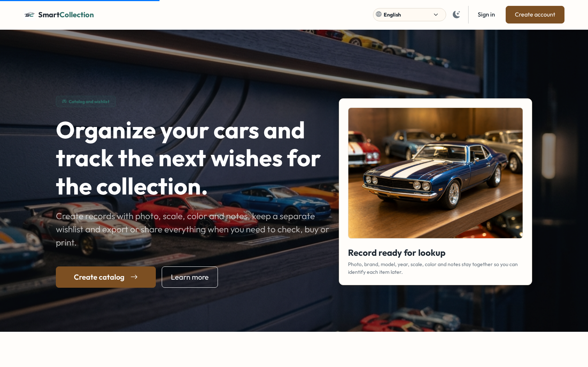
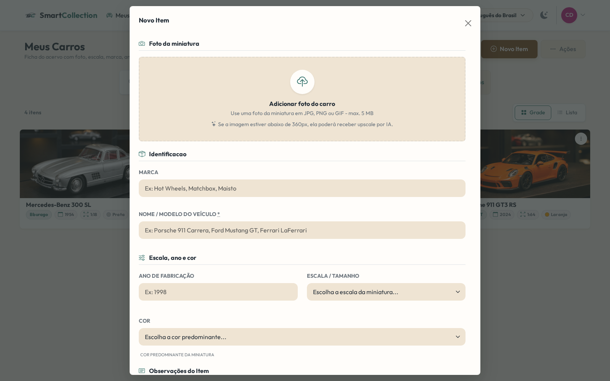

# Smart Collection Catalog

<p align="center">
  
</p>

[Read in English](README.md)

O **Smart Collection Catalog** é uma aplicação Rails privada para catalogar itens colecionáveis, com foco forte em miniaturas de carros. O projeto combina gestão manual de acervo, preparação local de imagens com IA, autodetecção baseada em YOLO, lista de desejos, compartilhamento público seguro e exportações em PDF/CSV.

## Tecnologias

- **Backend**: Ruby on Rails 8.1.3 e Ruby 3.3.10
- **Banco de dados**: MongoDB 7 com Mongoid 9
- **Autenticação**: Devise
- **Frontend**: Hotwire (Turbo + Stimulus), Bootstrap 5.3, Bootstrap Icons, Cropper.js e esbuild
- **Uploads e imagens**: CarrierWave, MiniMagick, metadados de recorte manual, conversão para JPG e geração de imagens de compartilhamento
- **Tempo real e jobs**: Action Cable, Redis 7, Sidekiq e Active Job
- **IA local**: detecção YOLO11s e upscale Real-ESRGAN
- **Testes e qualidade**: RSpec, FactoryBot, RuboCop, rails_best_practices, Flay, Playwright, ESLint e Bundler Audit
- **Infraestrutura**: Docker e Docker Compose

## Funcionalidades principais

- **Coleções privadas por padrão**: dados do usuário ficam escopados à conta autenticada.
- **Catálogo de carros**: cadastre marca, nome, ano, escala, cor, tags, observações, fotos, dados de recorte e metadados de IA.
- **Configuração inicial**: fluxo de preferências no primeiro acesso, incluindo opções como upscale por IA.
- **Autodetecção por IA**: envie uma foto com vários itens, deixe o serviço YOLO local detectar candidatos e revise os itens encontrados antes de salvá-los.
- **Preparação de imagens**: upscale local opcional por IA para fotos de carros, com variantes original/aprimorada e comportamento de fallback.
- **Recorte manual**: armazene coordenadas de recorte e processe fotos de forma assíncrona.
- **Lista de desejos**: gerencie itens desejados, prioridade, status, fotos, compartilhamento público da wishlist e exportações.
- **Compartilhamento público seguro**: coleções e wishlists só ficam públicas quando o compartilhamento está habilitado e o acesso usa um token explícito.
- **Imagens de compartilhamento**: gere PNGs de prévia/compartilhamento para carros, carros públicos, wishlists e itens da wishlist.
- **Exportações**: gere relatórios PDF e CSV para coleções e wishlists.
- **Área administrativa**: dashboard de uso, gestão de usuários e ações de manutenção para administradores autorizados.
- **UI em tempo real**: estados de processamento e atualizações de interface usam Turbo Streams.

## Capturas de tela





## Configuração

### Requisitos

- Docker e Docker Compose

### Instalação

1. Clone o repositório:

   ```bash
   git clone <repo-url>
   cd smart-collection
   ```

2. Crie o arquivo de ambiente a partir do template:

   ```bash
   cp .env.example .env
   ```

3. Crie o arquivo Compose local a partir do template oficial:

   ```bash
   cp docker-compose.example.yml docker-compose.yml
   ```

4. Revise o `.env` e escolha o Dockerfile do `upscale-service` em `docker-compose.yml`:

   - `upscale/Dockerfile.cpu` para o caminho padrão no Docker Desktop.
   - `upscale/Dockerfile.nvidia` para hosts NVIDIA/CUDA com NVIDIA Container Toolkit.
   - `upscale/Dockerfile.amd` para ambientes Linux AMD/ROCm validados.
   - `upscale/Dockerfile.vulkan` para testes experimentais com Vulkan/ncnn no Linux.

5. Suba os containers:

   ```bash
   docker compose up -d --build
   ```

6. Popule o banco:

   ```bash
   docker compose exec web bin/rails db:seed
   ```

7. Acesse a aplicação:

   ```text
   http://localhost:3000
   ```

## Locale

A aplicação possui arquivos de locale em português (`pt-BR`) e inglês (`en`). O português é o locale padrão atual em tempo de execução em `config/initializers/locale.rb`.

## Microserviços

O projeto inclui microserviços locais de IA via Docker Compose:

- `yolo-service`: detecção local YOLO11s e classificação simples de cor para fluxos de autodetecção. Veja [`yolo/README.md`](yolo/README.md).
- `upscale-service`: serviço local de upscale/preparação de imagem usado por uploads de fotos de carros quando `IMAGE_UPSCALE_SERVICE_URL` está configurada e o usuário permite upscale por IA. O setup padrão usa `upscale/Dockerfile.cpu`; veja [`upscale/README.md`](upscale/README.md).

Variáveis de ambiente importantes:

- `YOLO_SERVICE_URL`: URL interna do serviço YOLO, normalmente `http://yolo-service:8000`.
- `YOLO_API_KEY`: chave opcional enviada pelo header `X-API-Key`.
- `IMAGE_UPSCALE_SERVICE_URL`: URL interna do serviço de upscale, normalmente `http://upscale-service:8000`.
- `IMAGE_UPSCALE_API_KEY`: chave opcional enviada pelo header `X-API-Key`.
- `IMAGE_UPSCALE_DEFAULT_MINIMUM_SIDE`: lado mínimo para preparação de fotos de carros, com padrão `360`.

## Desenvolvimento

Comandos Rails, RSpec, RuboCop e QA do projeto devem rodar dentro do container `web`:

```bash
docker compose exec web bin/rails routes
docker compose exec web bin/safe_rspec
docker compose exec web bundle exec rubocop
```

Compile assets JavaScript e CSS com:

```bash
docker compose exec web npm run build
```

Rode testes Playwright focados dentro do container `web`:

```bash
docker compose exec web npm run test:e2e -- caminho/do/teste.spec.js --browser=chromium
```

Use `http://127.0.0.1:3000` para verificações de navegador executadas dentro do container `web`.

## Orientações do repositório

As regras específicas de agentes e qualidade do projeto ficam em [`AGENTS.md`](AGENTS.md). As definições locais de skills ficam em `.skills/`, com wrappers mínimos específicos de agente em `.codex/skills/` e `.gemini/skills/`.

## Licença

O Smart Collection Catalog é licenciado sob a GNU Affero General Public License v3.0 ou posterior. Veja [`LICENSE`](LICENSE).

Copyright (c) 2026 Eli Fachin Junior.

O nome do projeto, logotipo e identidade visual não são licenciados para uso de forma que sugira que um fork, instância hospedada ou derivado não oficial seja o projeto original ou tenha endosso do autor.
